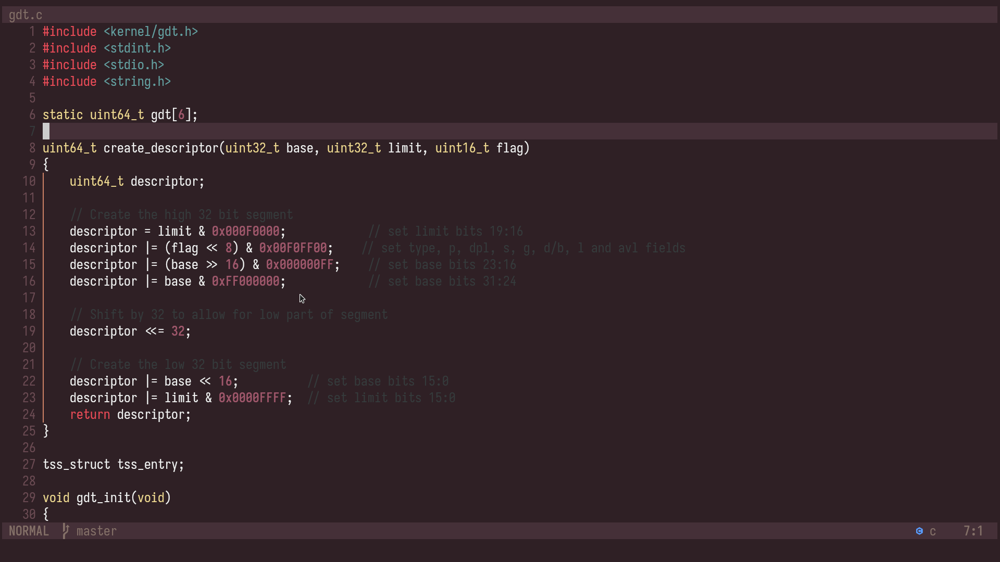

# Koalin-blossom colour scheme for neovim (and more)
- Ported from the [emacs-koalin-themes](https://github.com/ogdenwebb/emacs-kaolin-themes)



# Use
## Download
```lua
vim.pack.add({
  "https://github.com/c6rg0/kaolin-blossom.nvim",
})
-- Reload neovim and follow the prompt(s)
```

## Setup and config
```lua
require("kaolin-blossom").setup({
  transparent = false,
  italics = {
    comments = true,
    keywords = true,
    functions = true,
    strings = true,
    variables = true,
    bufferline = false,
  },
})
vim.cmd([[colorscheme kaolin-blossom]])
```

## To get newer versions of the package
```vim
:lua vim.pack.update()
```

# Features
- LSP/Treesitter support (afaik)
- Lualine support
- Includes an extra kitty terminal config

## To do
- Made && include a colour pallete image
- Fix any small details (e.g focused line number, comments)
- Add the rest of the kaolin colour schemes

# Contrubuting
- If you'd like to make a change - add a feature or fix an issue - you can contribute to this repo.
- To do so, make a fork (using github), create changes to your copy and submit a pull request to merge.

